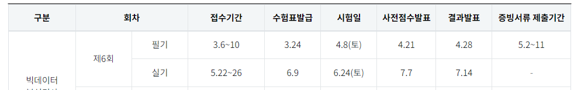

# 빅데이터 분석기사

## 일정

## 점수 배점

각 20문항

- 빅데이터 분석 기획(무조건 점수를 따고 들어가자!)
  - 가장 공부하기 수월한 과목으로 개념적인 내용을 물어보는 문제들이 주로 출제. 개인정보 처리와 비식별화, EDA강조

  1. 빅데이터 개요 및 활용(17%) : ETL, 가드너 3V, 데이터사이언티스트, 데이터 웨어하우스, 빅데이터 가치, 마이데이터
  2. 빅데이터 기술 및 제도(35%) : 딥러닝, 분석 5단계, 지도학습, 비식별화, 개인정보보호법, 데이터 거버넌스, 하둡, GDPR, 게이트웨이, 스파크
  3. 분석 방안 수립(25%) : EDA, 데이터 분석 기획, 절차, 접근 방법, 모델링, 진단 분석, 분석 성숙도, 시급성
  4. 분석 작업 계획(8%) : 이상값, 데이터 수집
  5. 데이터 수집 및 전환(10%) : 정형데이터 품질 보증, 민감 정보, 데이터 품질
  6. 데이터 적재 및 저장(5%) : nosql, HDFS, 제타바이트

- 빅데이터 탐색(개념을 이해하고 통계 문제에 대비하자!)
  - 난이도 있는 계산 문제 등장. 단순 암기가 아닌 기초 통계의 수학적 이해가 필요하며 전반적인 분포함수를 알고 있는지 확인.

  1. 데이터 정제(2%) : 데이터 정제
  2. 분석 변수 처리(20%) : 변수 선택, 파생 변수 생성, 학습데이터 불균형, 차원의 저주, 군집 불균형, 차원 축소, 변수 변환
  3. 데이터 탐색 기초(25%) : 박스 플롯, 산점도, 상관계수, median, 표본 추출, 왜도, 기초통계량, 이상치
  4. 고급 데이터 탐색(3%) : 주성분분석, 비정형데이터
  5. 기술통계(30%) : 전수조사, 불량률, 확률 계산, 층화추출, 확률분포, 포아송분포, 중심극한정리, 군집추출, 카이제곱, 확률밀도 함수
  6. 추론통계(20%) : 최대우도, Z계산, 점추정, 1종/2종 오류, 유의수준, 표본분산

- 빅데이터 모델링(높은 난이도, 주요 포인트 파악!)
  - 분석기법에 대한 심도 있는 내용과 모델의 특징을 이해하면 풀 수 있는 문제가 주로 출제되며 다양한 응용 알고리즘에 대한 학습 필요

  1. 분석 절차 수립(2%) : 모델링 절차
  2. 분석 환경 구축(5%) : K-fold 검정, 데이터 분할
  3. 분석기법(63%) : 변수 선택, 인공신경망, 합성곱 계층, 자가진단, SVM, LASSO, 로지스틱 회귀, 앙상블, 비지도학습, 지도학습-분류, 군집분석, 회귀분석, 활성화함수, 의사결정나무, DNN, CNN, RNN, 초매개변수
  4. 고급 분석기법(30%) : 자료 분석, 다차원 척도, 베이즈 정리, 시계열 자료, 자기상관, 비정형 데이터 형태, 랜덤 포레스트, 비모수적 통계 검정법, 배깅, 부스팅, ARMA

- 빅데이터 결과 해석(비교적 어렵지 않으므로 고득점을 노려보자!)
  - 검정, 진단, 모형 선택, 시각화에 대한 문제가 중심으로 출제. 각 차트별 특징을 이해하고 해석할 줄 알아야 한다.

  1. 분석모형 평가(43%) : 편향, 분산, 혼동 행렬, ROC, F1-score, 적합도 검정, 민감도, 특이도, 모형 진단, 정규성 검정, 홀드 아웃
  2. 분석모형 개선(12%) : 초매개변수, 모형 선택, 매개변수, 최적화
  3. 분석결과 해석(10%) : MAE, MAPE, 선형회귀, ROC, 지지도, 신뢰도
  4. 분석결과 시각화(25%) : 산점도, 막대그래프, 불균형 데이터셋, 인포그래픽, 버블차트, 카토그램
  5. 분석결과 활용(10%) : 모델링 타입, 분석결과 활용, 성과지표

## 공부 일정

- 4주 완성
  - 1쳅터 : 4일
  - 2쳅터 : 6일
  - 3쳅터 : 6일
  - 4쳅터 : 5일
  - 모의고사 : 7일

## 파일

- [빅데이터 분석 기획](./%EB%B9%85%EB%8D%B0%EC%9D%B4%ED%84%B0%20%EB%B6%84%EC%84%9D%20%EA%B8%B0%ED%9A%8D/readme.md)
